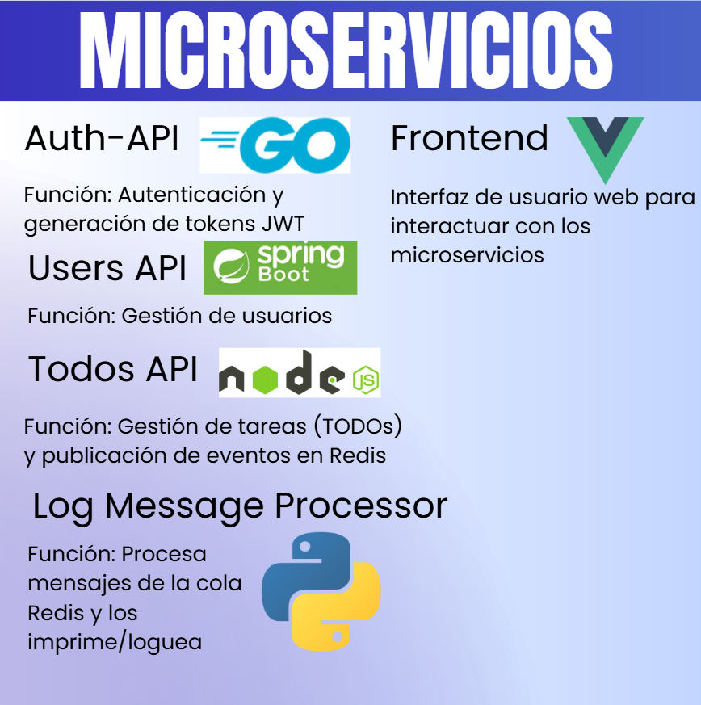
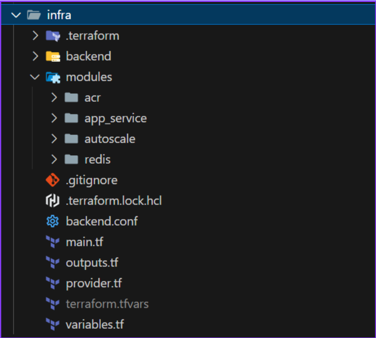
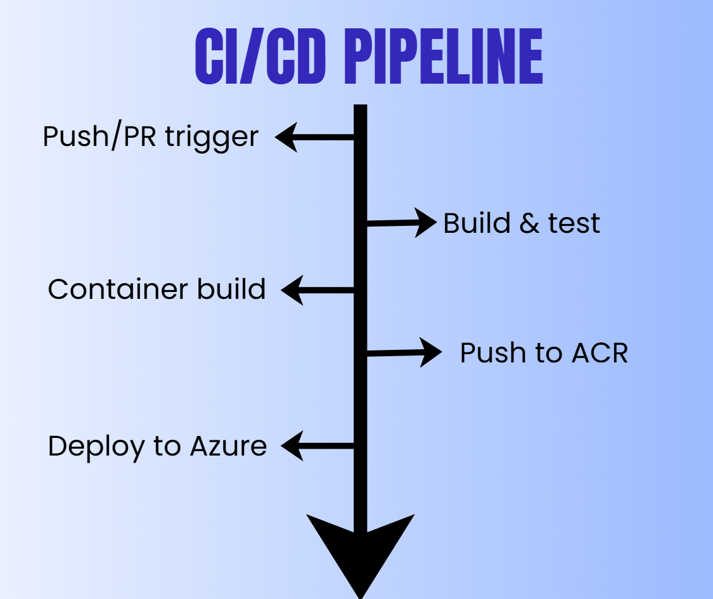
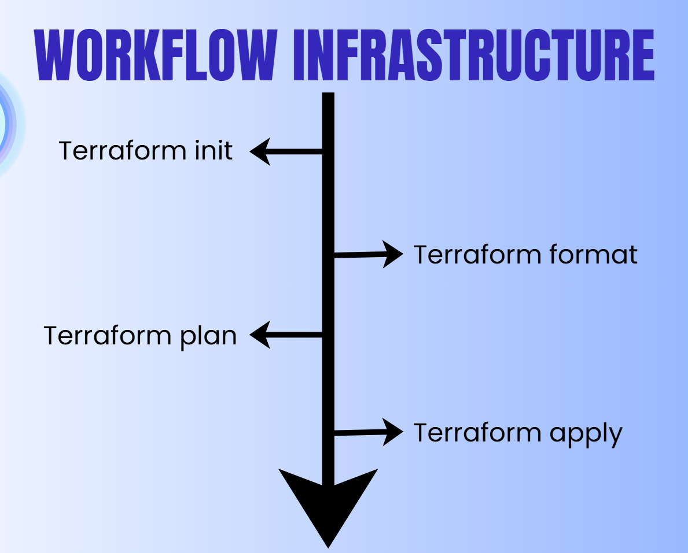
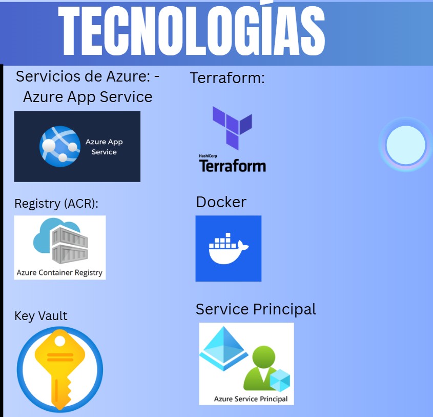
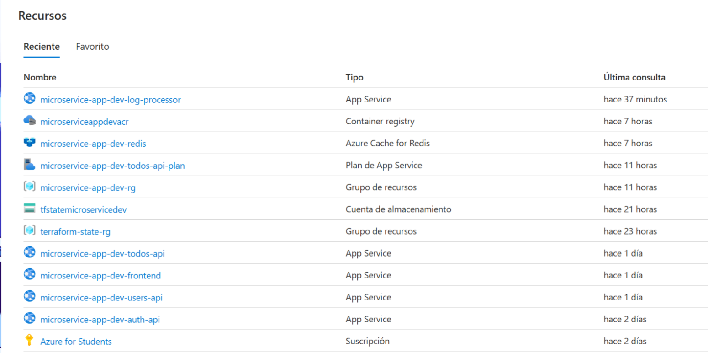
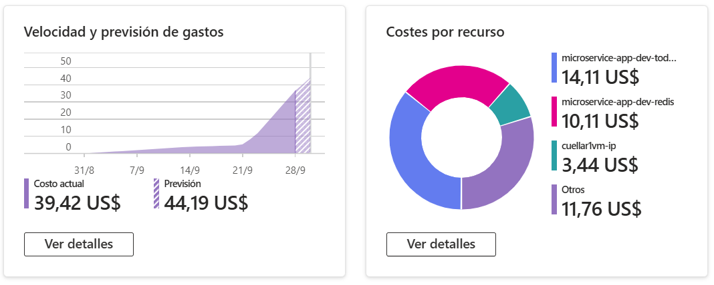

# Microservice App Example

Proyecto de aplicación TODO distribuida, diseñada con arquitectura de microservicios y pensada para prácticas de DevOps, despliegue, integración y experimentación con diferentes lenguajes y tecnologías.

## Arquitectura General

La aplicación está compuesta por los siguientes microservicios:

- **Users API** (Java Spring Boot): Gestión de usuarios.
- **Auth API** (Go): Autenticación y generación de JWT.
- **TODOs API** (Node.js): CRUD de tareas y logging a Redis.
- **Log Message Processor** (Python): Procesador de logs desde Redis.
- **Frontend** (Vue.js): Interfaz de usuario.


## Estructura del Proyecto

```
├── auth-api/                # Microservicio de autenticación (Go)
├── todos-api/               # Microservicio de tareas (Node.js)
├── users-api/               # Microservicio de usuarios (Java Spring Boot)
├── log-message-processor/   # Procesador de logs (Python)
├── frontend/                # Aplicación web (Vue.js)
├── infra/                   # Infraestructura como código (Terraform)
├── docker-compose.yml       # Orquestación de servicios
└── README.md
```



# Microservice App Example - Reporte de Implementación

## Índice

- [Antes: Estado Inicial del Proyecto](#antes-estado-inicial-del-proyecto)
- [Después: Trabajo Realizado](#después-trabajo-realizado)
- [Estándares y Buenas Prácticas](docs/project_standars.md)
- [Volver al README principal](#microservice-app-example---reporte-de-implementación)

---

## Antes: Estado Inicial del Proyecto

Al inicio, recibimos una base de código con los siguientes microservicios ya programados y funcionales:

- **Users API** (Java Spring Boot): Gestión de usuarios.
- **Auth API** (Go): Autenticación y generación de JWT.
- **TODOs API** (Node.js): CRUD de tareas y logging a Redis.
- **Log Message Processor** (Python): Procesador de logs desde Redis.
- **Frontend** (Vue.js): Interfaz de usuario.

La estructura del proyecto era la siguiente:

```
├── auth-api/
├── todos-api/
├── users-api/
├── log-message-processor/
├── frontend/
├── infra/
├── docker-compose.yml
└── README.md
```

Cada microservicio contaba con su propia lógica, pero no existía una solución de orquestación ni despliegue automatizado.

---

## Después: Trabajo Realizado

### 1. Contenerización de Microservicios

- Se creó un `Dockerfile` específico para cada microservicio ([auth-api/Dockerfile](auth-api/Dockerfile), [todos-api/Dockerfile](todos-api/Dockerfile), [users-api/Dockerfile](users-api/Dockerfile), [log-message-processor/Dockerfile](log-message-processor/Dockerfile), [frontend/Dockerfile](frontend/Dockerfile)).
- Se aseguraron buenas prácticas de construcción, uso de imágenes base apropiadas y definición de variables de entorno.

### 2. Orquestación Local con Docker Compose

- Se diseñó un archivo [docker-compose.yml](docker-compose.yml) para levantar todos los servicios de manera coordinada en local.
- Esto permitió pruebas integradas y facilitó el desarrollo colaborativo.

### 3. Infraestructura como Código (IaC) con Terraform

- Se implementó el directorio [infra/](infra/) con módulos reutilizables para cada recurso.



- Recursos principales creados:
  - **Azure Container Registry (ACR):** Para almacenar imágenes de contenedores ([infra/modules/acr](infra/modules/acr)).
  - **App Services y App Service Plans:** Para desplegar cada microservicio y el frontend ([infra/modules/app_service](infra/modules/app_service)).
  - **Redis Cache:** Para la persistencia y comunicación entre servicios ([infra/modules/redis](infra/modules/redis)).
  - **Autoscaling:** Configuración de escalado automático para el TODOs API ([infra/modules/autoscale](infra/modules/autoscale)).
  - **Zipkin:** Para trazabilidad distribuida ([infra/modules/zipkin](infra/modules/zipkin)).
  - **Backend remoto:** Almacenamiento del estado de Terraform en Azure Storage ([infra/backend](infra/backend)).

- Se parametrizó el despliegue usando variables para versiones, credenciales y configuración de cada entorno.

### Diagrama de Arquitectura


### 4. Automatización de Workflows CI/CD

- Se crearon workflows en [`.github/workflows/`](.github/workflows/) para:
  - Construir y subir imágenes de cada microservicio al ACR.
  - Desplegar automáticamente la última versión (`latest`) en los App Services correspondientes.
  - Uso de **Service Principal** para autenticación segura con Azure.
  - Cada push de una nueva versión de un contenedor actualiza el App Service para apuntar a la imagen `latest`, asegurando despliegue continuo.



#### Pipeline de Infraestructura
Además se realizó el workflow para cuando se modifique en la carpeta de /infra, automáticamente se hagan los cambios en el Azure

El terraform apply solamente se realiza cuando se completa el PR a master



### 5. Estándares y Buenas Prácticas

- Se documentaron los estándares de desarrollo, branching y commits en [docs/project_standars.md](docs/project_standars.md).
- [Ir a los estándares del proyecto →](docs/project_standars.md)

### 6. Patrones de Diseño

En este proyecto se implementaron los siguientes patrones de diseño clave para la escalabilidad y eficiencia:

- **Autoscaling (Escalado Automático):**
  - Se configuró el escalado automático para el microservicio TODOs API usando un App Service Plan Standard S1.
  - **Reglas de escalado:**
    - Si la CPU > 70% → Scale Out (+1 instancia)
    - Si la memoria > 80% → Scale Out (+1 instancia)
    - Si la CPU < 30% → Scale In (-1 instancia)
  - **Límites:** mínimo 1 instancia, máximo 3 instancias.
  - Esto permite ajustar dinámicamente los recursos según la demanda, optimizando costos y asegurando alta disponibilidad.

- **Cache Aside:**
  - Se implementó el patrón Cache Aside usando Redis. Los microservicios consultan primero la caché antes de acceder a la base de datos.
  - Si el dato no está en caché, se recupera de la base de datos y se almacena en Redis para futuras consultas.
  - Este enfoque reduce la carga sobre la base de datos principal y mejora el rendimiento general de la aplicación.

Ambos patrones contribuyen a la escalabilidad, resiliencia y eficiencia de la solución, alineándose con las mejores prácticas de arquitectura de microservicios en la nube.

### 7. Teconologías usadas



### 8. Portal Azure

Evidencia de los recursos creados en Azure a partir de terraform.



### 9. Costos

Se evidenció un costo un poco alto, donde el mayor causante es el uso de un App Service Plan Standard S1 para el AutoScaling, razón por la que el autoscaling es solamente aplicado a este servicio.



---

## Conclusión

El proyecto pasó de ser un conjunto de microservicios aislados a una solución completamente orquestada, automatizada y lista para despliegue en Azure, siguiendo buenas prácticas de DevOps e infraestructura como código.

### Conclusiones Adicionales

- **Arquitectura de Microservicios:** La adopción de microservicios permitió desacoplar responsabilidades, facilitando la escalabilidad y el mantenimiento de cada componente de forma independiente.

- **Contenerización y Orquestación:** El uso de contenedores y Docker Compose simplificó el proceso de desarrollo local y la integración entre servicios, reduciendo errores de configuración y acelerando la puesta en marcha de nuevos entornos.

- **Azure App Services:** La implementación en Azure App Services proporcionó una plataforma PaaS robusta que simplificó el despliegue y la gestión de los microservicios, eliminando la complejidad de administrar la infraestructura subyacente.

- **CI/CD e Infraestructura como Código:** La integración de pipelines CI/CD y la infraestructura como código (IaC) con Terraform mejoró la trazabilidad, repetibilidad y seguridad en los despliegues, minimizando la intervención manual y los riesgos asociados.

- **Patrones de Escalabilidad:** La implementación de patrones como Cache Aside con Redis y Autoscaling en App Services demostró ser fundamental para optimizar el rendimiento y la eficiencia de los recursos, alineándose con escenarios reales de producción en la nube.

- **Experiencia de Aprendizaje:** El proyecto sirvió como una excelente base para experimentar con tecnologías en la nube de Azure, buenas prácticas de DevOps y estrategias de despliegue automatizado con App Services, sentando las bases para futuras mejoras y ampliaciones.

- **Optimización de Costos:** El análisis de costos reveló la importancia de seleccionar adecuadamente los niveles de servicio (como el App Service Plan Standard S1 para autoscaling), equilibrando rendimiento y economía en soluciones cloud.

## Autores

[Nicolás Cuéllar Molina](https://github.com/Nicolas-CM)

[Samuel Álvarez Alban](https://github.com/Freddyedd21)

[⬆️ Volver al inicio del README](#microservice-app-example---reporte-de-implementación)