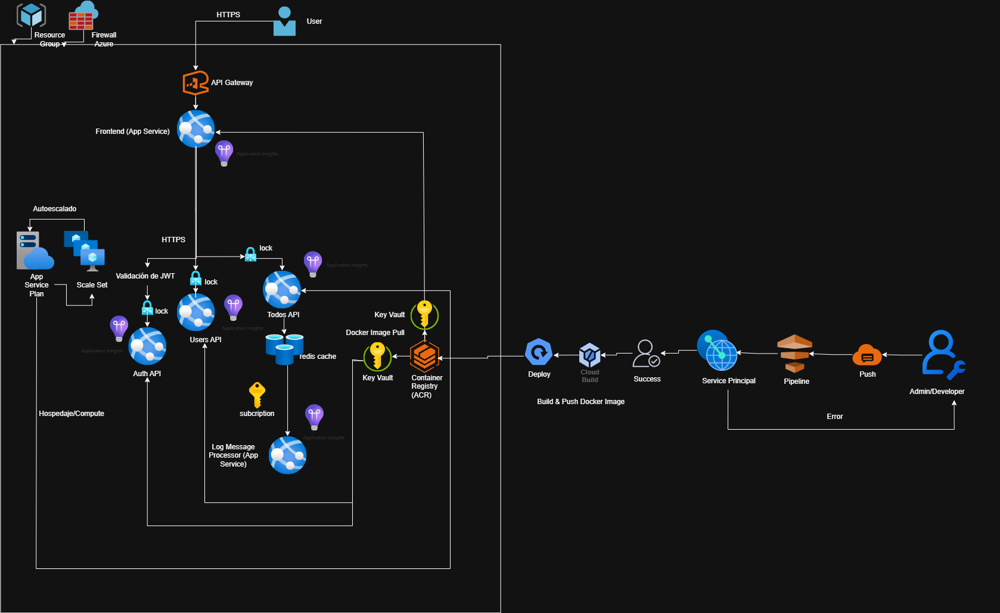

# Microservice App Example

Proyecto de aplicación TODO distribuida, diseñada con arquitectura de microservicios y pensada para prácticas de DevOps, despliegue, integración y experimentación con diferentes lenguajes y tecnologías.

## Arquitectura General

La aplicación está compuesta por los siguientes microservicios:

- **Users API** (Java Spring Boot): Gestión de usuarios.
- **Auth API** (Go): Autenticación y generación de JWT.
- **TODOs API** (Node.js): CRUD de tareas y logging a Redis.
- **Log Message Processor** (Python): Procesador de logs desde Redis.
- **Frontend** (Vue.js): Interfaz de usuario.


## Estructura del Proyecto

```
├── auth-api/                # Microservicio de autenticación (Go)
├── todos-api/               # Microservicio de tareas (Node.js)
├── users-api/               # Microservicio de usuarios (Java Spring Boot)
├── log-message-processor/   # Procesador de logs (Python)
├── frontend/                # Aplicación web (Vue.js)
├── infra/                   # Infraestructura como código (Terraform)
├── docker-compose.yml       # Orquestación de servicios
└── README.md
```
# Microservice App Example - Reporte de Implementación

## Índice

- [Antes: Estado Inicial del Proyecto](#antes-estado-inicial-del-proyecto)
- [Después: Trabajo Realizado](#después-trabajo-realizado)
- [Estándares y Buenas Prácticas](docs/project_standars.md)
- [Volver al README principal](#microservice-app-example---reporte-de-implementación)

---

## Antes: Estado Inicial del Proyecto

Al inicio, recibimos una base de código con los siguientes microservicios ya programados y funcionales:

- **Users API** (Java Spring Boot): Gestión de usuarios.
- **Auth API** (Go): Autenticación y generación de JWT.
- **TODOs API** (Node.js): CRUD de tareas y logging a Redis.
- **Log Message Processor** (Python): Procesador de logs desde Redis.
- **Frontend** (Vue.js): Interfaz de usuario.

La estructura del proyecto era la siguiente:

```
├── auth-api/
├── todos-api/
├── users-api/
├── log-message-processor/
├── frontend/
├── infra/
├── docker-compose.yml
└── README.md
```

Cada microservicio contaba con su propia lógica, pero no existía una solución de orquestación ni despliegue automatizado.

---

## Después: Trabajo Realizado

### 1. Contenerización de Microservicios

- Se creó un `Dockerfile` específico para cada microservicio ([auth-api/Dockerfile](auth-api/Dockerfile), [todos-api/Dockerfile](todos-api/Dockerfile), [users-api/Dockerfile](users-api/Dockerfile), [log-message-processor/Dockerfile](log-message-processor/Dockerfile), [frontend/Dockerfile](frontend/Dockerfile)).
- Se aseguraron buenas prácticas de construcción, uso de imágenes base apropiadas y definición de variables de entorno.

### 2. Orquestación Local con Docker Compose

- Se diseñó un archivo [docker-compose.yml](docker-compose.yml) para levantar todos los servicios de manera coordinada en local.
- Esto permitió pruebas integradas y facilitó el desarrollo colaborativo.

### 3. Infraestructura como Código (IaC) con Terraform

- Se implementó el directorio [infra/](infra/) con módulos reutilizables para cada recurso.
- Recursos principales creados:
  - **Azure Container Registry (ACR):** Para almacenar imágenes de contenedores ([infra/modules/acr](infra/modules/acr)).
  - **App Services y App Service Plans:** Para desplegar cada microservicio y el frontend ([infra/modules/app_service](infra/modules/app_service)).
  - **Redis Cache:** Para la persistencia y comunicación entre servicios ([infra/modules/redis](infra/modules/redis)).
  - **Autoscaling:** Configuración de escalado automático para el TODOs API ([infra/modules/autoscale](infra/modules/autoscale)).
  - **Zipkin:** Para trazabilidad distribuida ([infra/modules/zipkin](infra/modules/zipkin)).
  - **Backend remoto:** Almacenamiento del estado de Terraform en Azure Storage ([infra/backend](infra/backend)).

- Se parametrizó el despliegue usando variables para versiones, credenciales y configuración de cada entorno.



### 4. Automatización de Workflows CI/CD

- Se crearon workflows en [`.github/workflows/`](.github/workflows/) para:
  - Construir y subir imágenes de cada microservicio al ACR.
  - Desplegar automáticamente la última versión (`latest`) en los App Services correspondientes.
  - Uso de **Service Principal** para autenticación segura con Azure.
  - Cada push de una nueva versión de un contenedor actualiza el App Service para apuntar a la imagen `latest`, asegurando despliegue continuo.

### 5. Estándares y Buenas Prácticas

- Se documentaron los estándares de desarrollo, branching y commits en [docs/project_standars.md](docs/project_standars.md).
- [Ir a los estándares del proyecto →](docs/project_standars.md)

---

## Conclusión

El proyecto pasó de ser un conjunto de microservicios aislados a una solución completamente orquestada, automatizada y lista para despliegue en Azure, siguiendo buenas prácticas de DevOps e infraestructura como código.

## Autores

[Nicolás Cuéllar Molina](https://github.com/Nicolas-CM)

[Samuel Álvarez Alban](https://github.com/Freddyedd21)

[⬆️ Volver al inicio del README](#microservice-app-example---reporte-de-implementación)